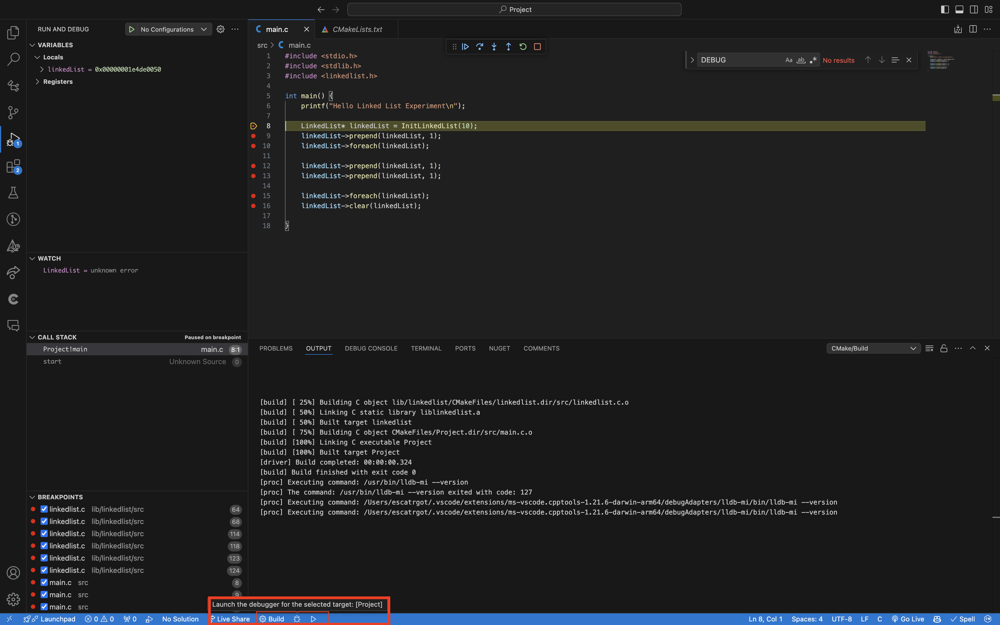
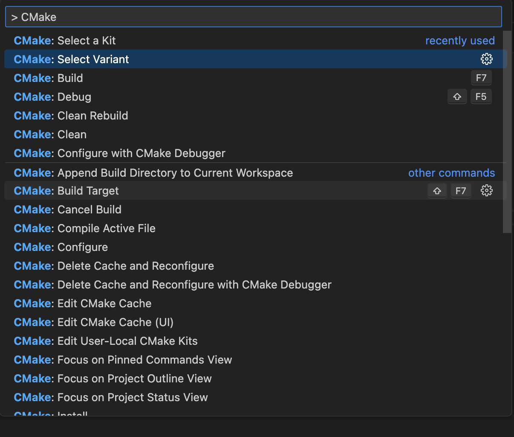
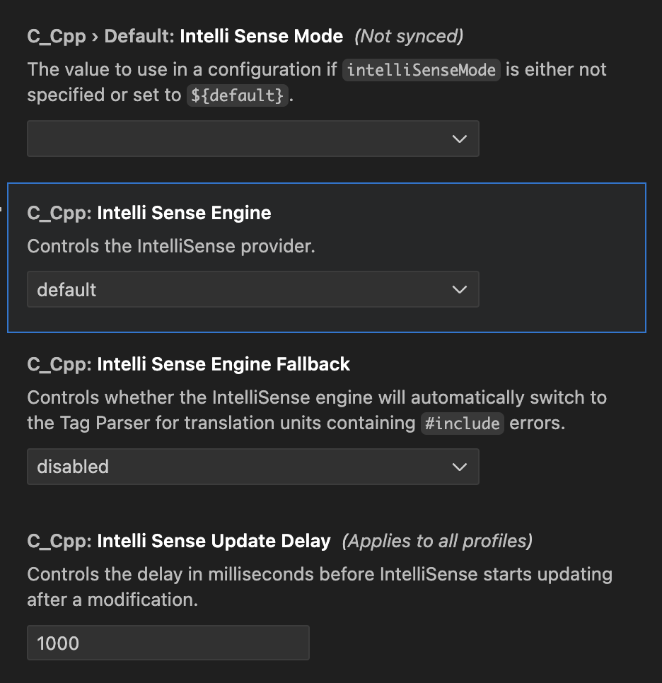
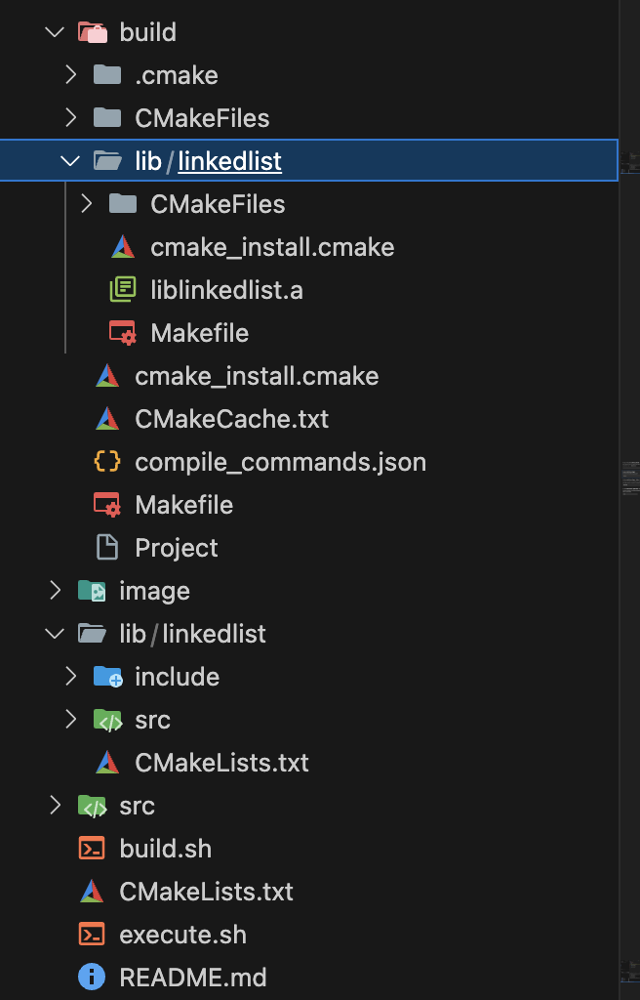

# 포큐 아카데미를 듣기 전 테스트.

3200 언매니지드 프로그래밍 선행 과목중 C 언어가 있었고,
여기서 배웠어야 하는 내용은 바로
1. 포인터를 자유자제로 다룰 수 있는 능력
2. 메모리 할당과 해제에 대한 능력

위 두가지 역량을 확인 해 보는것을 권장 받았기 때문에 이 프로젝트를 진행함.

---

## 목차
1. 빌드 시스템 구축
   - 1-1. CMake Debug 환경 구축
   - 1-2. 분리된 빌드 시스템 (NEW!)
2. LinkedList 자료구조
3. M1 Pro 에서 프로파일링

---

> ### 1. 빌드 시스템 구축

#### 1-1). 분리된 빌드 시스템 (NEW!)

이 프로젝트는 **라이브러리**와 **프로젝트**의 빌드 타겟을 분리함

##### ① 빌드 단계

1. **라이브러리 빌드**: 먼저 모든 라이브러리를 빌드하고 설치
2. **프로젝트 빌드**: 설치된 라이브러리를 사용하여 실제 프로젝트 빌드

##### ② 사용법
```bash
# 라이브러리 빌드
./shell/CMakeLibraries.sh unix

# 프로젝트 빌드
./shell/CMakeProject.sh unix (0 / 1)

# 메모리 누수 검사와 함께 빌드
./shell/CMakeExecute.sh unix (0 / 1)
```

##### ③ 빌드 디렉터리 구조

```
build_libraries/          # 라이브러리 빌드 결과
├── install/              # 설치된 라이브러리
│   ├── lib/             # 정적 라이브러리 파일
│   └── include/         # 헤더 파일
└── ...

build_project/            # 프로젝트 빌드 결과
├── clang-project        # 실행 파일
└── ...
```

#### 1-2). CMake Debug 환경 구축
https://github.com/microsoft/vscode-cmake-tools/issues/1412
https://www.youtube.com/watch?v=Qng2RW_bjS8&ab_channel=CodingwithMat


만약 아래와 같은 에러가 뜨면서 디버깅이 안될 수 있다.
```bash
[main] Failed to prepare executable target with name "undefined"
```
그럴때는 `command + p` -> `> CMake : Select Varient` -> `Debug` 사용해 보기




#### 2). VScode Intellisense

https://sidosidopy.tistory.com/68

간혹 `command + p` -> `> C/C++: Edit Configurations` 세팅이 없을 수도 있는데 그럴때 확인해 볼것은아래 그림에 인텔리 센스 엔진이 default가 되어 있는지 아닌지 확인해 볼것




#### 3). 정적 라이브러리 빌드

##### 외부 폴더 include 폴더 연결

개발중 헤더폴더를 include로 선언, 소스코드를 src로 구현함으로 다음과 같은 폴더 구조를 가짐
```bash
.
└── linkedlist
    ├── CMakeLists.txt
    ├── include
    │   └── linkedlist.h
    └── src
        └── linkedlist.c # linkedlist.h를 참조한
```

하지만 include 경로가 설정이 안되어 헤더파일이 계속 인텔리센스에서 못불러오는 경우가 생김.
그렇다고 억지로 헤더 연결을 해준다고 다음과 같이 적는것은 아니다.
```c
/* linkedlist.c */

#include "../include/linkedlist.h" ❌ 이걸 원하는게 아님!

#include "linkedlist.h" ✅ 바로 이런것, 그런데 폴더 위치가 상위에 있으면 어떻게 참조하지?
```

그럴때. CMakeLists.txt를 통해 의존성 관리를 진행하면된다.

```txt
# lib/linkedlist/CmakeLists.txt

target_include_directories(linkedlist
PUBLIC
    include
)
```

##### lib 또한 빌드를 해줘야 하는것은 아니다.

`lib/linkedlist/CmakeLists.txt` 를 서브 디렉토리러 설정하면
lib에서 `CMake -B build .`빌드를 실행하지 않아도
알아서 CMake 루트 빌드 폴더에 정적라이브러리가 생김



---

> ### 2. LinkedList 자료구조

이 프로젝트를 진행하면서 알아낸 C

1. 포인터와 레퍼런스
2. 동적 할당과 해제 `malloc()` `free()`
3. 구조체 typedef & 구조체 포인터
4. 함수 포인터
5. 에러핸들링 `abort()`


---

> ### 3). 프로파일링

xcode의 instrument의 **leaks** 을 사용해서 프로파일링을 진행해보자

https://www.youtube.com/watch?v=bhhDRm926qA&ab_channel=MikeShah

환경변수도 설정하기 위해
```bash
# .zshrc

...
# leaks를 사용할때 필요한 환경변수
export MallocStackLogging=1
...
```

`leaks --atExit --list -- ./build/Project` 실행하면 된다.

---

##### 1. `clear()` 안했을때 결과

<details>

<summary>  📁 펼치기 📁 </summary>

   ```c
   #include <stdio.h>
   #include <stdlib.h>
   #include <linkedlist.h>

   int main() {
       printf("Hello Linked List Experiment\n");

       LinkedList* linkedList = InitLinkedList(10);

       linkedList->prepend(linkedList, 10);
       linkedList->prepend(linkedList, 20);
       linkedList->prepend(linkedList, 30);
       linkedList->prepend(linkedList, 40);
       linkedList->foreach(linkedList);

       return 0;
   }
   ```

   ```bash
   leaks Report Version: 3.0
Process 23320: 191 nodes malloced for 16 KB
Process 23320: 5 leaks for 240 total leaked bytes.

Leak: 0x153f040f0  size=112  zone: MallocStackLoggingLiteZone_0x104480000   malloc in InitLinkedList  C  Project
        Call stack: 0x1805b4274 (dyld) start | 0x104413718 (Project) main | 0x1044137a4 (Project) InitLinkedList | 0x18076e894 (libsystem_malloc.dylib) _malloc_zone_malloc_instrumented_or_legacy

Leak: 0x153f04160  size=32  zone: MallocStackLoggingLiteZone_0x104480000   malloc in CreateNode  C  Project
        Call stack: 0x1805b4274 (dyld) start | 0x104413730 (Project) main | 0x1044139f4 (Project) Prepend | 0x104413e90 (Project) AddNodeFirstTime | 0x104413e44 (Project) CreateNode | 0x18076e894 (libsystem_malloc.dylib) _malloc_zone_malloc_instrumented_or_legacy

Leak: 0x153f04180  size=32  zone: MallocStackLoggingLiteZone_0x104480000   malloc in CreateNode  C  Project
        Call stack: 0x1805b4274 (dyld) start | 0x104413744 (Project) main | 0x104413a00 (Project) Prepend | 0x104413e44 (Project) CreateNode | 0x18076e894 (libsystem_malloc.dylib) _malloc_zone_malloc_instrumented_or_legacy

Leak: 0x153f041a0  size=32  zone: MallocStackLoggingLiteZone_0x104480000   malloc in CreateNode  C  Project
        Call stack: 0x1805b4274 (dyld) start | 0x104413758 (Project) main | 0x104413a00 (Project) Prepend | 0x104413e44 (Project) CreateNode | 0x18076e894 (libsystem_malloc.dylib) _malloc_zone_malloc_instrumented_or_legacy

Leak: 0x153f041c0  size=32  zone: MallocStackLoggingLiteZone_0x104480000   malloc in CreateNode  C  Project
        Call stack: 0x1805b4274 (dyld) start | 0x10441376c (Project) main | 0x104413a00 (Project) Prepend | 0x104413e44 (Project) CreateNode | 0x18076e894 (libsystem_malloc.dylib) _malloc_zone_malloc_instrumented_or_legacy
   ```

</details>

##### 2. `clear()` 했을때 결과

<details>

<summary>  📁 펼치기 📁 </summary>

```c
#include <stdio.h>
#include <stdlib.h>
#include <linkedlist.h>

int main() {
    printf("Hello Linked List Experiment\n");

    LinkedList* linkedList = InitLinkedList(10);

    linkedList->prepend(linkedList, 10);
    linkedList->prepend(linkedList, 20);
    linkedList->prepend(linkedList, 30);
    linkedList->prepend(linkedList, 40);
    linkedList->foreach(linkedList);

    linkedList->clear(linkedList);

    return 0;
}
```

```
Project(23058) MallocStackLogging: could not tag MSL-related memory as no_footprint, so those pages will be included in process footprint - (null)
Project(23058) MallocStackLogging: recording malloc (and VM allocation) stacks using lite mode
Hello Linked List Experiment
10 20 30 40
RemoveNodeData 10
RemoveNodeData 20
RemoveNodeData 30
RemoveNodeData 40
Process 23058 is not debuggable. Due to security restrictions, leaks can only show or save contents of readonly memory of restricted processes.

Process:         Project [23058]
Path:            /Users/USER/Library/Mobile Documents/com~apple~CloudDocs/*/Project
Load Address:    0x10005c000
Identifier:      Project
Version:         0
Code Type:       ARM64
Platform:        macOS
Parent Process:  leaks [23057]

Date/Time:       2024-10-13 04:30:58.004 +0900
Launch Time:     2024-10-13 04:30:53.017 +0900
OS Version:      macOS 15.0.1 (24A348)
Report Version:  7
Analysis Tool:   /Applications/Xcode.app/Contents/Developer/usr/bin/leaks
Analysis Tool Version:  Xcode 16.0 (16A242d)

Physical footprint:         2145K
Physical footprint (peak):  2145K
Idle exit:                  untracked
----

leaks Report Version: 3.0
Process 23058: 187 nodes malloced for 16 KB
Process 23058: 1 leak for 112 total leaked bytes.

Leak: 0x1330040d0  size=112  zone: MallocStackLoggingLiteZone_0x1000cc000   malloc in InitLinkedList  C  Project
        Call stack: 0x1805b4274 (dyld) start | 0x10005f708 (Project) main | 0x10005f7a4 (Project) InitLinkedList | 0x18076e894 (libsystem_malloc.dylib) _malloc_zone_malloc_instrumented_or_legacy


Binary Images:
       0x10005c000 -        0x10005ffff +Project (0) <25FB8560-3848-3B7C-8A5E-BC7655801F52> /Users/*/Library/Mobile Documents/com~apple~CloudDocs/*/Project
       0x100088000 -        0x100088ffb  libLeaksAtExit.dylib (64566.82.1) <D6FF34F5-BC27-35D0-9908-024532BE2599> /usr/lib/libLeaksAtExit.dylib
       0x18055c000 -        0x1805adcb3  libobjc.A.dylib (928.2) <F453C5AE-3568-3AAA-AAA0-D2FDFBB9BC7A> /usr/lib/libobjc.A.dylib
       0x1805ae000 -        0x180630663  dyld (1.0.0 - 1231.3) <40BEDD20-DA23-3B70-A9C2-A1C68A738762> /usr/lib/dyld
       0x180631000 -        0x180634ff8  libsystem_blocks.dylib (94) <D38CBAF7-2370-388C-942E-4657370DC34E> /usr/lib/system/libsystem_blocks.dylib
       0x180635000 -        0x18067ffff  libxpc.dylib (2866.1.1) <FA954AC0-FCC5-3711-800B-432011ACD89E> /usr/lib/system/libxpc.dylib
       0x180680000 -        0x18069bfff  libsystem_trace.dylib (1612.0.4) <E3A66187-AE55-3C0D-A4D5-4867E8800246> /usr/lib/system/libsystem_trace.dylib
       0x18069c000 -        0x18073efdf  libcorecrypto.dylib (1736.0.43) <85B327D9-E202-382B-BCF1-95FA18A6F94B> /usr/lib/system/libcorecrypto.dylib
       0x18073f000 -        0x18077fff7  libsystem_malloc.dylib (646.0.13) <ED8C6BDE-145D-3B94-8C86-4E5E5FD021D1> /usr/lib/system/libsystem_malloc.dylib
       0x180780000 -        0x1807c6fff  libdispatch.dylib (1502.0.1) <465565E8-EF8A-3188-80FA-598063C54161> /usr/lib/system/libdispatch.dylib
       0x1807c7000 -        0x1807c9ffb  libsystem_featureflags.dylib (94) <1F74D054-6164-357E-93E8-33B33802298F> /usr/lib/system/libsystem_featureflags.dylib
       0x1807ca000 -        0x18084bffb  libsystem_c.dylib (1669.0.4) <A63F0EF9-59F1-3976-8A7E-2037CD50C605> /usr/lib/system/libsystem_c.dylib
       0x18084c000 -        0x1808d9ffb  libc++.1.dylib (1800.101) <57FFCB9D-A6C9-3E9A-AA82-40F192626527> /usr/lib/libc++.1.dylib
       0x1808da000 -        0x1808f4fff  libc++abi.dylib (1800.101) <676AF2E8-EC78-3E6E-8275-2130FEFCFE8E> /usr/lib/libc++abi.dylib
       0x1808f5000 -        0x18092fff7  libsystem_kernel.dylib (11215.1.12) <616EB42E-C350-321E-8002-FB82BD999276> /usr/lib/system/libsystem_kernel.dylib
       0x180930000 -        0x18093cfff  libsystem_pthread.dylib (535) <D09F4078-ADAD-3DD0-B17B-CE0142887B28> /usr/lib/system/libsystem_pthread.dylib
       0x18093d000 -        0x180967ff3  libdyld.dylib (1231.3) <2344BBD1-FE44-3F47-B6D1-E6035860C983> /usr/lib/system/libdyld.dylib
       0x180968000 -        0x18096ffe3  libsystem_platform.dylib (340) <3FAC373B-5C41-3C83-8F9F-C9E781E887DA> /usr/lib/system/libsystem_platform.dylib
       0x180970000 -        0x18099fffb  libsystem_info.dylib (592) <DE5359E2-EBB1-33F6-BE0B-F6C38FC8C313> /usr/lib/system/libsystem_info.dylib
       0x184054000 -        0x18405eff7  libsystem_darwin.dylib (1669.0.4) <29E1B808-15D0-31EC-B11E-46D079B2B129> /usr/lib/system/libsystem_darwin.dylib
       0x1844b7000 -        0x1844c9fff  libsystem_notify.dylib (327.0.5) <60FC794B-254E-3275-BDEB-43C07FE57937> /usr/lib/system/libsystem_notify.dylib
       0x1863e4000 -        0x1863fefff  libsystem_networkextension.dylib (2049.1.6) <1180813D-C91A-30BF-9F4D-3C13E59B59EF> /usr/lib/system/libsystem_networkextension.dylib
       0x18647a000 -        0x186492ffb  libsystem_asl.dylib (402) <41AE52F9-CA3B-3E46-894E-53C3FAE2F718> /usr/lib/system/libsystem_asl.dylib
       0x187f51000 -        0x187f59fff  libsystem_symptoms.dylib (2001.0.2) <C66FC9EA-598E-369E-AAE4-C765FF4EDCFD> /usr/lib/system/libsystem_symptoms.dylib
       0x18b660000 -        0x18b68eff7  libsystem_containermanager.dylib (683) <FF849207-8D0E-3B13-AD56-0B09D4E97892> /usr/lib/system/libsystem_containermanager.dylib
       0x18c88c000 -        0x18c890fff  libsystem_configuration.dylib (1345) <EC4E2AB6-1540-3210-9D1A-E7BBEBFE72E2> /usr/lib/system/libsystem_configuration.dylib
       0x18c891000 -        0x18c897ff7  libsystem_sandbox.dylib (2401.1.3) <EE21AC3C-245E-318D-B6A5-35C7F7578CD7> /usr/lib/system/libsystem_sandbox.dylib
       0x18d797000 -        0x18d799ffb  libquarantine.dylib (181.0.7) <EFC4870A-5EFD-3AA2-8AE8-A3AF553B7693> /usr/lib/system/libquarantine.dylib
       0x18de9f000 -        0x18dea5ffb  libsystem_coreservices.dylib (167) <4696C8D2-8F57-3E9E-9C12-9ABF28E9FFF6> /usr/lib/system/libsystem_coreservices.dylib
       0x18e2f7000 -        0x18e334fff  libsystem_m.dylib (3289) <A9F7FDC9-BC69-3406-BFC0-7278591FB060> /usr/lib/system/libsystem_m.dylib
       0x18e336000 -        0x18e33aff7  libmacho.dylib (1021.4) <9DE36DDD-3F75-3A62-86AD-94C37D8C6F4A> /usr/lib/system/libmacho.dylib
       0x18e358000 -        0x18e365fff  libcommonCrypto.dylib (600032) <80C7370B-96D7-32BA-9900-4B4B7FE56E20> /usr/lib/system/libcommonCrypto.dylib
       0x18e366000 -        0x18e371fff  libunwind.dylib (1800.85) <98CBBF04-0BDC-3EE1-9274-6A0F82546506> /usr/lib/system/libunwind.dylib
       0x18e372000 -        0x18e379fff  liboah.dylib (342) <7A391278-F708-3C76-AFA7-F965733E6733> /usr/lib/liboah.dylib
       0x18e37a000 -        0x18e384ff7  libcopyfile.dylib (213) <5EC169BA-DF2C-329D-BF64-E09F39FCF97F> /usr/lib/system/libcopyfile.dylib
       0x18e385000 -        0x18e388fff  libcompiler_rt.dylib (103.3) <575A1928-36CD-3E63-87C8-0AAD9510F1B0> /usr/lib/system/libcompiler_rt.dylib
       0x18e389000 -        0x18e38dffb  libsystem_collections.dylib (1669.0.4) <F781ABF6-C80E-30EB-8867-365B1F6ECCC0> /usr/lib/system/libsystem_collections.dylib
       0x18e38e000 -        0x18e391ffb  libsystem_secinit.dylib (153.0.6) <19924EAC-2ADD-3AB0-8662-EB5DFB8AD918> /usr/lib/system/libsystem_secinit.dylib
       0x18e392000 -        0x18e394fff  libremovefile.dylib (75) <437AF95C-1B61-3CBE-A686-9D8AB328DDE2> /usr/lib/system/libremovefile.dylib
       0x18e395000 -        0x18e395fff  libkeymgr.dylib (31) <05E385EB-3D0A-306A-ADDC-ADF12CB61BE6> /usr/lib/system/libkeymgr.dylib
       0x18e396000 -        0x18e39efff  libsystem_dnssd.dylib (2559.1.1) <7FE913EB-497C-3D4E-9972-E18483B0A639> /usr/lib/system/libsystem_dnssd.dylib
       0x18e39f000 -        0x18e3a4ffb  libcache.dylib (95) <4FB0104B-2774-325C-8DA9-3B385AF74B43> /usr/lib/system/libcache.dylib
       0x18e3a5000 -        0x18e3a6ffb  libSystem.B.dylib (1351) <9D5C0242-0D53-337B-81F7-8599E0376CA8> /usr/lib/libSystem.B.dylib
       0x1a7fc4000 -        0x1a7fd0ffb  com.apple.MallocStackLogging (1.0 - 64566.105.1) <EFD1EA4B-D86E-3704-A075-C0465194B4DA> /System/Library/PrivateFrameworks/MallocStackLogging.framework/Versions/A/MallocStackLogging
       0x25a3e0000 -        0x25a3e3fff  libsystem_darwindirectory.dylib (122) <0BD4EE9B-08BF-38DC-BF1F-3B50238678F2> /usr/lib/system/libsystem_darwindirectory.dylib
       0x25a3e4000 -        0x25a3eaffb  libsystem_eligibility.dylib (122.0.2) <0108C321-2FF3-381C-84C3-A5F28AD74796> /usr/lib/system/libsystem_eligibility.dylib
       0x25a3eb000 -        0x25a3f0fff  libsystem_sanitizers.dylib (17.0.1) <E89B7342-DD39-3FA5-8952-D8A4875C16FD> /usr/lib/system/libsystem_sanitizers.dylib
```
</details>

##### 3. `free(linkedList)`

```c
#include <stdio.h>
#include <stdlib.h>
#include <linkedlist.h>

int main() {
    printf("Hello Linked List Experiment\n");

    LinkedList* linkedList = InitLinkedList(10);

    linkedList->prepend(linkedList, 10);
    linkedList->prepend(linkedList, 20);
    linkedList->prepend(linkedList, 30);
    linkedList->prepend(linkedList, 40);
    linkedList->foreach(linkedList);

    linkedList->clear(linkedList);

    /*
    Leak: 0x122f040f0  size=112  zone: MallocStackLoggingLiteZone_0x102ac0000   malloc in InitLinkedList  C  Project
        Call stack: 0x1805b4274 (dyld) start | 0x102a53708 (Project) main  main.c:8 | 0x102a537a4 (Project) InitLinkedList  linkedlist.c:7 | 0x18076e894 (libsystem_malloc.dylib) _malloc_zone_malloc_instrumented_or_legacy

    Clear은 그저 linkedList의 내용물을 모두 지우는 것이지 linkedList 자체를 지우는 것이 아니다.
    따라서 linkedList를 free해주어야 한다.
    */
    free(linkedList);
    return 0;
}
```

```bash
leaks Report Version: 3.0
Process 29479: 186 nodes malloced for 16 KB
Process 29479: 0 leaks for 0 total leaked bytes.
```
