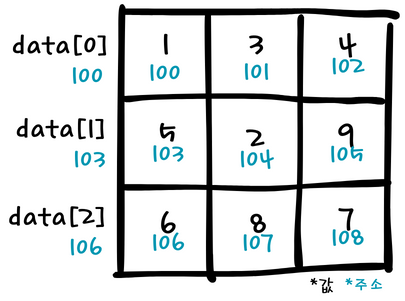
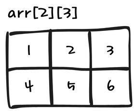
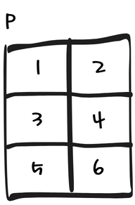

---

## 4-1. 2차원 배열과 포인터

---

> ### 📄 1. 배열과 주소 관계

<div align=center>  
    
</div>

```c  
int data[0][3] = {1, 3, 4, 5, 2, 9, 6, 8, 7}; // 3열
int *p = data[1];
int x, y;
x = *p;
y = *(p + 2);
printf("%d, %d", x, y);
```


> ### 📄 2. 배열 `[]`과 포인터 `*`

##### ① `[]` : 복수의 메모리 공간 블럭이 할당된 상태
* `[]`는 일종의 연산자로, Brackets (array subscript)라고 불린다. `a[10] == *(a + 10)`
* `char name[64] = "Hello Jhon"` 이건 스택 할당 스트링이다.

##### ② `*`  배열의 첫 시작 주소값을 저장하기 위해 하나 할당된 상태 
* 저장 공간 크기는 알 수 없다
* `*`는 마찬가지로 일종의 연산자로 Dereference 라고 불린다.
* `char *str = "Hello, world!";`     
    이건 문자열 리터럴 이라는 것으로 읽기 전용 메모리에 저장된다. 
    그리고 이 메모리를 수정하는것은 정의되지 않는다.

##### 비교 항목
  | /   | 배열 `[]` | 포인터 `*`|
  | --- | --- | --- |
  | 크기        | 고정된 메모리 블록   | 주소값 하나                |
  | 이름        | 상수 (변경 불가)     | 변수 (다른 주소 저장 가능) |
  | sizeof(arr) | 전체 크기            | 포인터 크기                |

> ### 📄 3. 배열의 행 열 크기 변환

#### 1). C

```c
int arr[2][3] = {1, 2, 3, 4, 5, 6}; // 2행3열
int (*p)[2] = NULL; // 2열로 만들어라
p = arr;
printf("%d,", *(p[0] + 1) + *(p[1] + 2));
printf("%d,", *(*(p + 1) + 0) + *(*(p + 1) + 1));
```
```c
int (*p)[N];
int *r[N];
p = (int (*)[N])malloc(N * N * sizeof(int));

// 여기서 2차원 배열을 1차원 배열의 포인터로 캐스팅 할때, 괄호를 제거해서는 안된다.
// (*p)[N] != *r[N] 이 둘이 나타내는 바는 다르다.
    // r은 "int *" 타입이 N개 있다는것이고
    // p는 "int[]" 타입을 레퍼런싱 하는것이다.
```

<div align=center>  
    
</div>

#### 2). C++ 

> C allows implicit conversions to/from void*, 
which C++ does not. You need to cast to the correct type.

```cpp
int arr[1][36] = {0, };

int N = 36;
for(int i = 1; i < N; i++) arr[0][i] = i;

int (*p1)[2] = reinterpret_cast<int (*)[2]>(arr); 
```

#### 3). 2차원 배열을 1차원 포인터 배열로

```c
b[i][j] = *( <b[i]> + j);
b[i][j] = '(*(b + i))'[j];
b[i][j] = *( <'(*(b + i))'> + j);

b[5][2] 이란 배열이 있으면
b[i][j] = *( b + (5 * i) + (j) );
b[i][j] = *( &b[0][0] + (5 * i) + (2));

c[10][7][13]이란 배열이 있으면
c[i][j][k] = * (&c[0][0][0] + 
                    (7 * 13 * i) + 
                    (13 * j) + 
                    (k))
```

#### [Code : ArrayRowCol](./src/PointerNReference/ArrayRowCol.cpp)

----

## 4-2. 배열의 사이즈와 포인터

---

```c
void ArraySize() {
    int a[N] = {0,};
    int b[N][N] = {0,};

    cout << sizeof(a[N]) << endl;       // 4
    cout << sizeof(a) << endl;          // 40
    cout << sizeof(b[N][N]) << endl;    // 4
    cout << sizeof(b[N]) << endl;       // 40
    cout << sizeof(b) << endl;          // 400
}
```
```c
void ArrayColOutofBound() {
    int a[3][3] = {0,};
    // sizeof(a) / sizeof(int) = Array2d'sSize
    for(int i = 0; i < sizeof(a) / sizeof(int); i++) 
    {
        a[0][i] = i; // 이거 가능하다!
    }
    for(int i = 0; i < 3; i++) {
        for(int j = 0; j < 3; j++) {
            cout << a[i][j] << endl;
        }
    }
}
```

> ### 📄 5. 스택 할당 배열

* 배열에 의한 메모리 할당의 가장 큰 장점은 해제 과정이 필요없다??
    * 배열의 경우 정적 할당시 
    * 이미 해당 작업 공간을 할당해 있으므로 메모리 사용에제약이 가져올 수 있습니다.

#### 1). C/C++

* 배열의 메모리 할당
    1. 전역적 정의 : static 메모리
    2. 함수 블럭 정의 : stack 메모리
       * 따라서 malloc, calloc 을 통해서 할당하지 않았다면 free 해주면 안된다
       * 함수 종료시 삭제된다.

* 스트링 메모리 할당

#### 2). C#

* 배열의 메모리 할당
    `Span`을 통한 stack alloc 으로 스택할당 배열이 사용 가능하다.

* `List<T>` 다른 것들은 모두 Heap에 할당된다
    대신 컨테이너 풀을 사용하면 C/CPP 처럼 할당 해제와 겟,릴리즈가 대응된다.

* 스트링 메모리 할당 (힙)
    ```cpp
    char *str = (char *)malloc(100 * sizeof(char));
    if (str != NULL) {
        strcpy(str, "Hello, world!");
    }
    ```

---

https://people.eecs.ku.edu/~jrmiller/Courses/JavaToC++/StackAllocatedObjects.html
https://onesside-world.tistory.com/44
https://www.geeksforgeeks.org/c/operators-in-c/