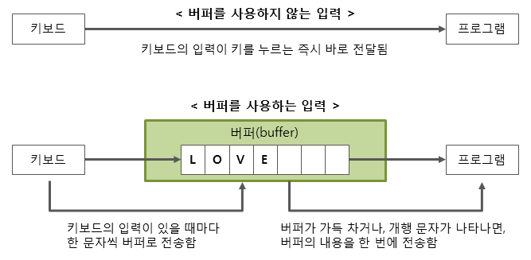
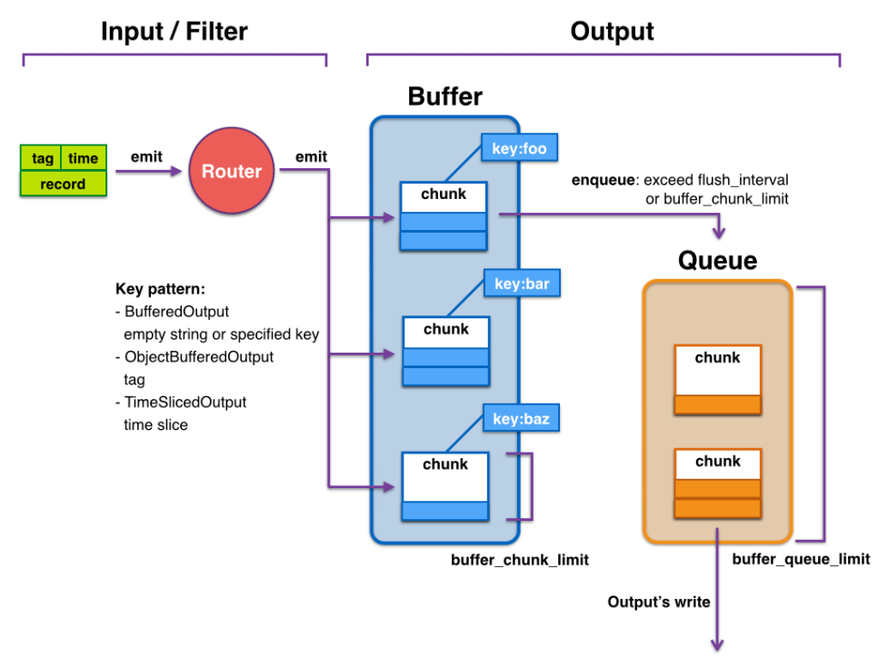
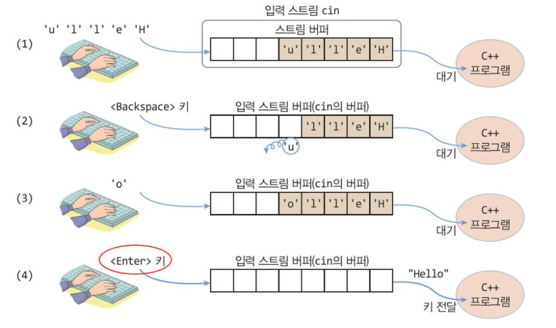
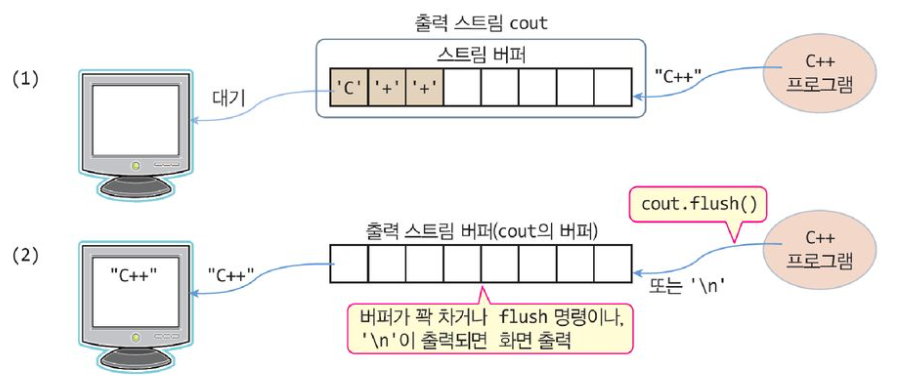

## 1. 용어 정리


> ### 📄 1. Stream

[scanf/printf 팁](https://data-make.tistory.com/263)
[[C++ I/O]스트림(stream)](https://velog.io/@jinh2352/%EC%8A%A4%ED%8A%B8%EB%A6%BCstream)
[큰돌 : C++ 코딩테스트 팁 : endl보다는 '\n'을 써라.](https://blog.naver.com/jhc9639/222829118583)

<div align=center>
    
</div>

**연속적인 데이터의 흐름 혹은 데이터를 전송하는 소프트웨어 모듈**을 일컫는다

* 스트림 장치 : **파일, 키보드, 네트워크**
* 운영체제 : **다양한 스트림 장치의 데이터를 추상화된 인터페이스(스트림) 처리**한다.

#### `tty`
* 현재 표준 입력과 연결된 터미널이 무엇인지 보이는 커맨드
    ```shell
    tty
    ```

#### 1). 입력 스트림(input stream)
* 외부(키보드, 파일)등에서 프로그램으로 데이터를 순서대로 프로그램에 전달하는 객체

#### 2). 출력 스트림(output stream)
* 프로그램에서 외부(콘솔, 파일 등)로 데이터를 출력하는 순서대로 내보내는 객체
* 출력 전에 버퍼라는 임시 공간에 저장을 하게된다.

> ### 📄 2. Stream Buffer

Stream이라 하여 반드시 버퍼가 있는것은 아니지만,
C++ 입출력 스트림의 중요한 특징은 **스트림이 버퍼를 가진다는 것**

<div align=center>
    
    <h5>흐름도</h5>
</div>


#### 스트림에서 버퍼를 쓰면 좋은 이유.
> https://stackoverflow.com/questions/4751972/endl-and-flushing-the-buffer
> buffering this problem is solved.
> 1. it would be very inefficient to write to a network or disk stream
byte by byte, by buffering
> 2. program crashes you may lose part of the data you wrote to the log file through the stream

#### 1). 입력 스트림 버퍼(input stream buffer)

<div align=center>
    
</div>

* 입력된 데이터를 프로그램에 전달하기 전에 일시 저장하는 공간
* enter을 누르기 전까지는  여러 문자 키 혹은 backspace 등등 버퍼에 저장/제거를 한다.


#### 2. 출력 스트림 버퍼(output stream buffer)

<div align=center>
    
</div>


* 출력 장치로 보내기 전에 데이터를 임시 저장하는 공간
* 출력 스트림의 버퍼가 꽉 찰 때 스크린에 출력시킨다.
* 사용자 의지로 `'\n'`이 도착하거나
`flush()`로 출력 스트림에 버퍼에 있는 내용을 모두 장치에 출력한다.
    1. `'\n'` : 개행문자며, 출력을 할 지언정 버퍼의 내용을 비우지는 않는다.
    2. `flush()` 버퍼플러시  : 출력도 하면서 버퍼의 내용을 모두 비운다.
       스트림이 보유한 버퍼라는 메모리 공간 -> 하드 디스크로 데이터를 전송하는것
        ```
        ex). 저장하시겠습니까?
            1. 저장하지 않고 닫기(소멸)
            2. 저장시 하드디스크로 플러시
        ```

#### 3. `endl`

* `endl`은 `'\n'`와, `flush()`를 둘다 실행하도록 래핑한것이다.
    ```
    `endl` : ‘\n’ + 버퍼플러시
    "\n" << flush; 와 << endl;는 같다고 보시면 됩니다.
    ```


<h4 class=summary>요약</h5>

1. 스트림 각각 마다 버퍼 존재, 하나하나 char 저장함
2. 입력 스트림 : 스트림 장치에서 여러 문자 키 혹은 backspace로 **입력 버퍼에 저장/제거**
3. 출력 : **출력 버퍼에 하나씩 쌓이다가** 화면에 출력 `'\n'`, `flush()`

> ### 📄 3. C++ / C 스트림 동기화

[[c++] ios::sync_with_stdio, cin.tie, cout.tie란?](https://velog.io/@d2h10s/c-iossyncwithstdio%EB%9E%80)


#### 1. `ios_base::sync_with_stdio(true)`
c의 stream, c++의 스트림이 **같은 버퍼**에 쌓임.
멀티스레딩에도 안전함.

#### 2. `ios_base::sync_with_stdio(false)`
c의 stream, c++의 스트림이 **각각의 버퍼를 독립적으로 사용**.
입출력 속도를 증가시킬 수 있습니다
멀티 쓰레딩 시 충돌이 발생할 수 있고
저마다의 버퍼를 사용하여 출력하기 때문에 입출력 순서가 보장되지 않습니다

#### 3. `cin.tie(nullptr), cout.tie(nullptr)`
입력 스트림 버퍼, 출력 스트림 버퍼 두가지 스트림에 대해
"입력, 출력 되기 전에 flush 해줌" -(untie)-> **"굳이 수시로 flush 하지 말고 받기"**

> ### 📄 4. `EOF` & `\n`

#### 1). `EOF`
* `EOF`는 string이 아니라 하나츼 char값이다.
  * `Ctrl + D`를 통해 입력할 수 있다.
* 파일이나 입력 스트림이 더이상 읽을 데이터가 없음을 나타내는 특수 값임.
* 예시
    ```c
    #include <stdio.h>

    int main() {
        int c;  // getchar()는 int 타입으로 반환하므로 char 대신 int 사용

        printf("텍스트를 입력하세요 (EOF로 종료):\n");

        // getchar()로 하나씩 문자를 입력받고, EOF를 만날 때까지 처리
        while ((c = getchar()) != EOF) {
            if (c == '\n') {
                printf("줄 바꿈 문자(\\n)를 만났습니다.\n");
            } else {
                printf("입력된 문자: %c\n", c);
            }
        }

        printf("EOF를 만났습니다. 프로그램을 종료합니다.\n");

        return 0;
    }
    ```

#### 2). `\n`
* ASCII 코드로 10에 해당함.
* 줄을 바꿀 때 사용하는 특수 문자로, 줄의 끝을 나타냄

> ### 📄 5. ECT.

#### 1). window input
* [GameInput fundamentals](https://learn.microsoft.com/en-us/gaming/gdk/_content/gc/input/overviews/input-fundamentals)

#### 2). Interactive 문제
* `flush()` 혹은 `endl`은 Interactive 문제에서도 중요하게 염두해야 하는 점 이다.
[Interactive 문제란 무엇인가요?](https://subinium.github.io/interactive-problem-in-ps/)

#### 3). `getline()`, `getchar()`

----

## 2. 입력 스트림

> ### 📄 1. C/C++ 문자열

#### 1). `char[] == char*`

```cpp
#include <iostream>
using namespace std;

int main() {
    char strArr[64] = "Hello World";
    char *strPtr = "Hello World";

    cout    << strArr << endl
            << strPtr << endl;

    return 0;
}
```

#### [Code : CharArrayPointer](./src/CharString/CharArrayPointer.cpp)

> ### 📄 2. `\0` 경계 검사

**`\0`** 문자열의 끝을 표시하는 용도로 사용되며,
이를 통해 문자열의 경계를 검사할 수 있습니다.

실제로 "Hello" 라는 문자열을 만든다고 가정할 때
길이보다 +1 만큼 Stack 공간을 할당해야 한다.

그 이유는 널 캐릭터를 넣어 경계검사가 가능하도록 해야 하기 때문이다.

```cpp
char str[6] = {'H', 'e', 'l', 'l', 'o', '\0'};
```

> ### 📄 3. `scanf()` VS `cin <<`

#### 4). **`scanf()`** 가 위험한 이유

* scanf doesn't actually read input from a keyboard.
What happens in the background is that scanf says
"go into the input stream (stdin) and find me this variable
* don't attention length of the typed strings
* 내가 사용할 메모리와 실제 가진 메모리에 들어가는지 아닌지 경계 검사를 하지 않는다.

scanf는 경계 겸사를 안한다.
4자 이상의 단어를 입력할 경우 배열 마지막에 \0을 포함하지 않는다.
가장 이상적인 형태는 다음이다 : ['D']['A']['M']['N']['\0']
하지만 이렇게 된다 : ['D']['A']['M']['N']

따라서 스트링에서 마지막 길이보다 1만큼 추가 할당해야한다.
