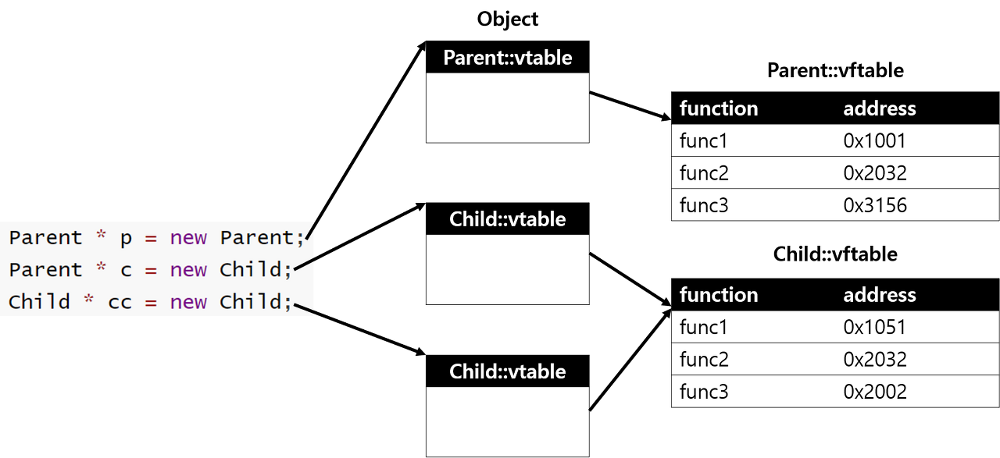
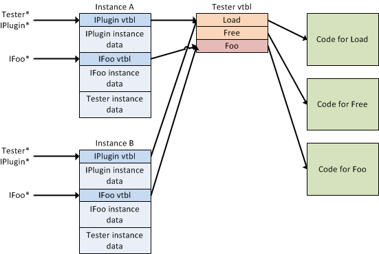

#### 1. 메모리 관점에서의 다형성:
다형성(Polymorphism)은 하나의 객체가 여러 형태의 자료형을 가질 수 있는 것을 말한다. 즉 특정 클래스로 만들어진 객체지만 다른 클래스 자료형으로도 객체가 사용가능하도록 하는 것이다.

상속관계와 오버라이딩 등에 의해 구현될 수 있다.

메모리에서는 객체의 실제 타입이 유지됩니다. 
그러나 다형성을 통해 인터페이스를 구현한 객체들은 동일한 인터페이스 타입으로 참조될 수 있습니다.
이러한 다형성을 가능하게 하는 메커니즘은 
가상 함수 테이블(virtual function table 또는 vtable)과 
포인터를 통해 구현됩니다.

객체는 해당하는 인터페이스의 포인터를 유지하고, 
호출 시에는 이 포인터를 통해 실제 메서드의 주소를 찾아가게 됩니다.

#### 2. 가상 함수 테이블 (vtable):




클래스가 인터페이스를 구현하면 해당 인터페이스에 정의된 가상 함수들에 대한 포인터가 클래스 내에 생성되고 가상 함수 테이블에 저장됩니다.
객체가 생성될 때 이 가상 함수 테이블에 대한 포인터가 객체의 메모리에 할당되며, 
이 포인터를 통해 실제 메서드가 호출됩니다.
메모리 관점에서의 다형성은 코드 관점에서의 추상화와는 다르게, 
실제로는 객체의 타입 정보를 유지하면서도 공통된 인터페이스를 통해 다양한 객체를 다룰 수 있는 편리함을 제공합니다. 
이는 프로그래머가 유연하게 코드를 작성할 수 있게 하며, 코드의 재사용성과 확장성을 높여줍니다.


#### 3. C언어에서 구현한 모습
C 언어는 객체지향 프로그래밍을 직접 지원하지 않기 때문에 클래스나 인터페이스의 개념이 없습니다. 
그러나 C 언어에서도 함수 포인터와 구조체를 사용하여 비슷한 기능을 구현할 수 있습니다.

다음은 C 언어에서 간단한 인터페이스와 다형성을 구현하는 예시입니다. 
이 예시에서는 함수 포인터를 사용하여 인터페이스를 나타내고, 구조체를 통해 객체의 메모리를 관리합니다.

```c
#include <stdio.h>

// 인터페이스 정의
    typedef struct {
    void (*draw)();
} ShapeInterface;

// 구현할 클래스에 해당하는 구조체 정의
typedef struct {
    ShapeInterface* interface;  // 인터페이스 포인터
    // 클래스 고유의 데이터 필드들
} Circle;

typedef struct {
    ShapeInterface* interface;  // 인터페이스 포인터
    // 클래스 고유의 데이터 필드들
} Square;

// 메서드 구현
void drawCircle() {
    printf("원 그리기\n");
}

void drawSquare() {
    printf("사각형 그리기\n");
}

// 객체 생성 함수
Circle* createCircle() {
    Circle* circle = malloc(sizeof(Circle));
    circle->interface = malloc(sizeof(ShapeInterface));
    circle->interface->draw = drawCircle;
    return circle;
}

Square* createSquare() {
    Square* square = malloc(sizeof(Square));
    square->interface = malloc(sizeof(ShapeInterface));
    square->interface->draw = drawSquare;
    return square;
}

// 클라이언트 코드
int main() {
    Circle* circle = createCircle();
    Square* square = createSquare();

    // 다형성을 통해 동일한 인터페이스로 다양한 객체를 다룰 수 있음
    circle->interface->draw();  // "원 그리기"
    square->interface->draw();  // "사각형 그리기"

    // 메모리 해제
    free(circle->interface);
    free(circle);

    free(square->interface);
    free(square);

    return 0;
}
```
이 코드에서 ShapeInterface는 인터페이스 역할을 하며, Circle과 Square은 해당 인터페이스를 구현한 구조체로서 객체를 나타냅니다. drawCircle과 drawSquare는 인터페이스에 정의된 메서드를 구현한 것이며, 객체 생성 함수와 클라이언트 코드를 통해 다형성을 사용할 수 있습니다. 메모리 관리를 위해 적절한 시점에 free 함수를 사용하여 할당된 메모리를 해제합니다.

#### 4. 객체 지향

C 언어는 객체지향 프로그래밍을 직접적으로 지원하지 않기 때문에 클래스 개념이 없습니다. 그러나 C 언어에서는 구조체(Struct)와 함수를 조합하여 객체와 유사한 개념을 만들 수 있습니다. 아래는 C 언어에서 구조체를 사용하여 멤버 변수와 메서드(함수)를 가지는 구조체의 예시입니다.

```c
#include <stdio.h>
#include <stdlib.h>

// 클래스에 해당하는 구조체 정의
typedef struct {
    // 멤버 변수
    int x;
    int y;

    // 메서드 (함수 포인터)
    void (*printCoordinates)(struct Point*);
    void (*move)(struct Point*, int, int);
} Point;

// 메서드 구현
void printCoordinates(Point* point) {
    printf("Coordinates: (%d, %d)\n", point->x, point->y);
}

void move(Point* point, int newX, int newY) {
    point->x = newX;
    point->y = newY;
}

// 객체 생성 함수
Point* createPoint(int initialX, int initialY) {
    Point* point = (Point*)malloc(sizeof(Point));

    // 멤버 변수 초기화
    point->x = initialX;
    point->y = initialY;

    // 메서드 초기화
    point->printCoordinates = printCoordinates;
    point->move = move;

    return point;
}

// 객체 소멸 함수
void destroyPoint(Point* point) {
    free(point);
}

int main() {
    // 객체 생성
    Point* myPoint = createPoint(1, 2);

    // 메서드 호출
    myPoint->printCoordinates(myPoint);  // "Coordinates: (1, 2)"
    myPoint->move(myPoint, 3, 4);
    myPoint->printCoordinates(myPoint);  // "Coordinates: (3, 4)"

    // 객체 소멸
    destroyPoint(myPoint);

    return 0;
}
```
이 예시에서 Point 구조체는 멤버 변수 x와 y를 가지고 있으며, 함수 포인터를 통해 printCoordinates와 move 메서드를 가지고 있습니다. createPoint 함수를 사용하여 객체를 생성하고 초기화하며, destroyPoint 함수를 사용하여 메모리를 해제합니다.

이런 식으로 구조체와 함수를 함께 사용하여 객체와 비슷한 개념을 만들 수 있지만, 이것은 객체지향 프로그래밍의 전체적인 특성과 개념을 제공하지 않습니다. 객체지향 프로그래밍을 진정으로 구현하려면 다른 언어를 사용하는 것이 더 효과적일 수 있습니다.